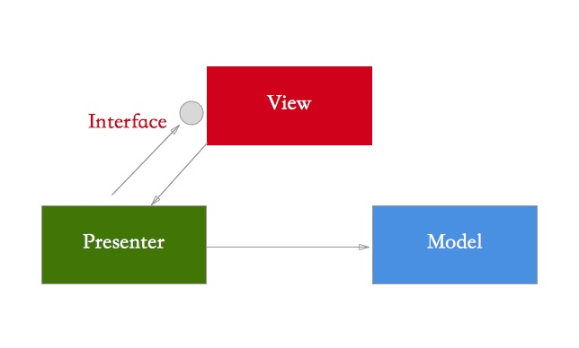

# MVPDemo
部分释义

### 整体俯瞰
1. 入口：在Xcode新建一个MVC界面，在**ViewController中添加MVP架构的模块。

	> 前面讲到MVC是Xcode固有的架构，所有入口没办法只能以此为准。
2. 以View为中心：MVP中，以View为交互中心，Model和Presenter辅之。

	> 1. 以View为中心，将其添加于MVC中。
	> 2. 初始化**所属**Presenter，获取**相关**Model
	> 3. Presenter**间接**更新View
	> 
	> 类似于NativeScript，加载XML(View)时，会查询同名的js和css文件(逻辑和布局文件)，然后加载之。
	>
	> 个人认为以View为中心，结构明朗，另外尽量在Presenter中不涉及View模块。
3. 图示（注意图示中箭头对应上述黑体`所属`、`相关`、`间接`）
	